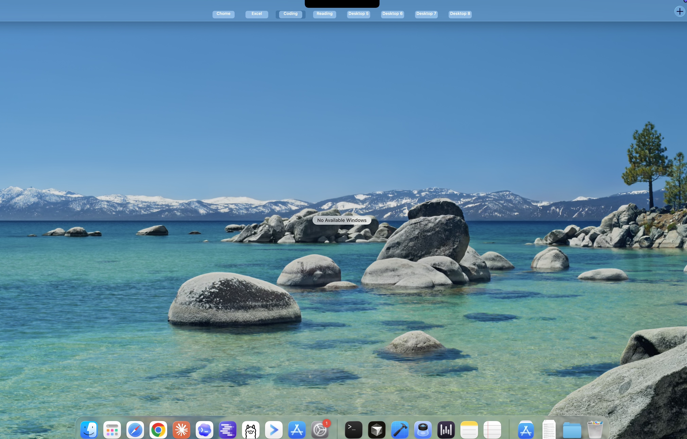
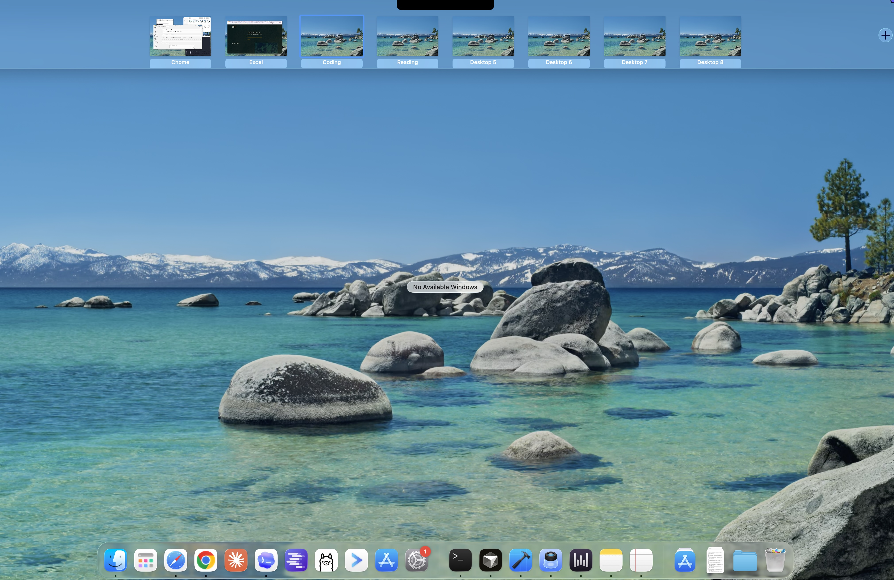

# Nook

> Stop squinting at "Desktop 4" trying to remember which one had your email open.

**Nook** is a tiny macOS menu bar app that lets you give your virtual desktops real names — "Coding", "Email", "That One With The Tabs I'm Afraid To Close" — and then shows them where you actually look: in Mission Control and (on notched MacBooks) right under the notch.

Because macOS gives you eight desktops and zero ways to tell them apart. 🤷

## See it in action

**Mission Control strip** (three-finger swipe up — first stage):

**Mission Control expanded** (mouse moves up — second stage):

Notice how the named Spaces show their names and the unnamed ones politely fall back to "Desktop 5", "Desktop 6"... Nook never breaks the muscle memory.

## Features

- 🏷️ **Names in Mission Control** — both stages of the trackpad gesture *and* the hot-corner / F3 view.
- 🎩 **Hover-activated notch** — on notched MacBooks, peek the active Space's name without opening Mission Control.
- 🖥️ **Per-display tracking** — each screen tracks its own active Space.
- ✏️ **Rename inline** — right-click (or Ctrl-click) a label in Mission Control.
- 🧠 **Collision-safe** — two Spaces named "Coding" become "Coding 1" and "Coding 2".
- 🆔 **UUID-anchored** — names follow their Space through reorders, reboots, and the occasional Mission Control mood swing.

## Status

🚧 **Alpha.** This is my **second-ever project** and very much open source — expect rough edges, weird AX behavior on macOS versions I haven't tested, and the occasional "wait, why did the label do *that*?" moment. Issues and PRs are extremely welcome; tell me what broke and on what hardware.

## Requirements

- macOS 13 Ventura or later
- Accessibility permission (Nook will ask on first launch — this is how it reads the Mission Control layout)

## Install

Just ask Claude to do it :) 

## How it works (the 30-second version)

Nook polls the macOS Accessibility tree to find Mission Control's layout, then floats a transparent overlay window on top with your custom names. It uses a `SpaceStore` actor backed by `UserDefaults` to persist the name ↔ Space-UUID mapping, so names survive reboots and reorders.

There's no private API spelunking, no kernel extensions, no daemons — just AX, AppKit, and a healthy amount of "let's see what happens when I swipe with three fingers."

## Contributing

1. Read [`CONTEXT.md`](CONTEXT.md) for the domain vocabulary (Space vs Desktop vs Display — they mean specific things).
2. Skim [`PRD.md`](PRD.md) for the full product spec.
3. Architecture decisions live in [`docs/adr/`](docs/adr/).
4. Open a PR or an issue. Don't be shy — this is alpha, every report helps.

## License

GPL-3.0 — see [`LICENSE`](LICENSE) and [`NOTICE`](NOTICE).

The notch-activation surface in `Nook/Notch/` is derived from
[mew-notch](https://github.com/monuk7735/mew-notch) (GPL-3.0) by Monu Kumar.
Per GPL copyleft, the combined work is now distributed under GPL-3.0; the
pre-GPL MIT history is preserved in `NOTICE`.
